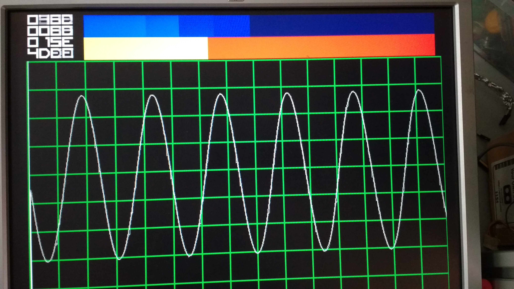

# crap-o-scope

I'm building a 6bit colour vga board for our FPGA work group. This started off as a test program but 
I got carried away and built a very poor scope instead.

uses 1092 of 1280 tiles on the ICE40H1k (IceStick) and 12 of 16 block rams.

## spec

* VGA display: 640 x 480 in glorious 6 bit colour!
* 10bit ADC clocked from the VGA clock - results in 1.5MHz sample rate
* 600 sample depth storage!
* graphical display of trigger level
* numerical display of sample level, number of triggers etc.

## design overview

graphics modules split up into:

* vga.v generator from my virtual graffiti project: https://github.com/mattvenn/fpga-virtual-graf
* color_sq.v for drawing a 2 colour bar graph 
* grid.v for the reticule
* numbers.v for the display of the 4 x 4 hex numbers
* waveform.v for connecting the dots of the samples with lines

other:

* adc.v for reading the ADC
* debounce.v for debouncing the encoder
* encoder.v for converting quadrature encoder to a count
 
useful modules from https://github.com/juanmard/screen-numbers

* fontROM.v implements a BRAM that can be initialised from a list (used for the numbers and the sample storage)
* image.v selects a pixel from the fontROM BRAM

# thanks

* [icestorm](http://www.clifford.at/icestorm/) opensource FPGA tools.

## License

Licensed under [GPL-2.0](https://opensource.org/licenses/GPL-2.0).

